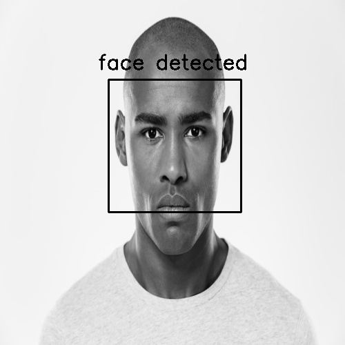
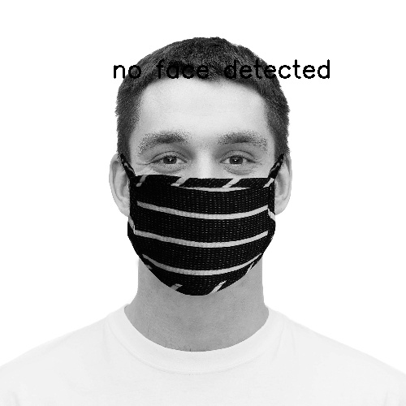

# Face Detection with OpenCV Haar Cascade Classifier

A simple project of face detection with OpenCV Haar Cascade classifier.

## Project Pipeline

- Load and resize [`images`](https://github.com/BandarAI/Face-Detection-with-OpenCV-Haar-Cascade-Classifier/tree/main/data) to 500x500 pixels.
- Convert images to grayscale
- Detect faces using Haar Cascade XML.
- Draw boxes around detected faces.
- Saves the output to [`results`](https://github.com/BandarAI/Face-Detection-with-OpenCV-Haar-Cascade-Classifier/tree/main/results) folder.

## Results

 

 
